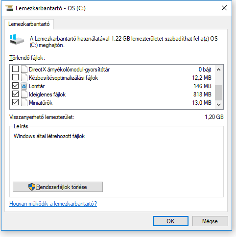
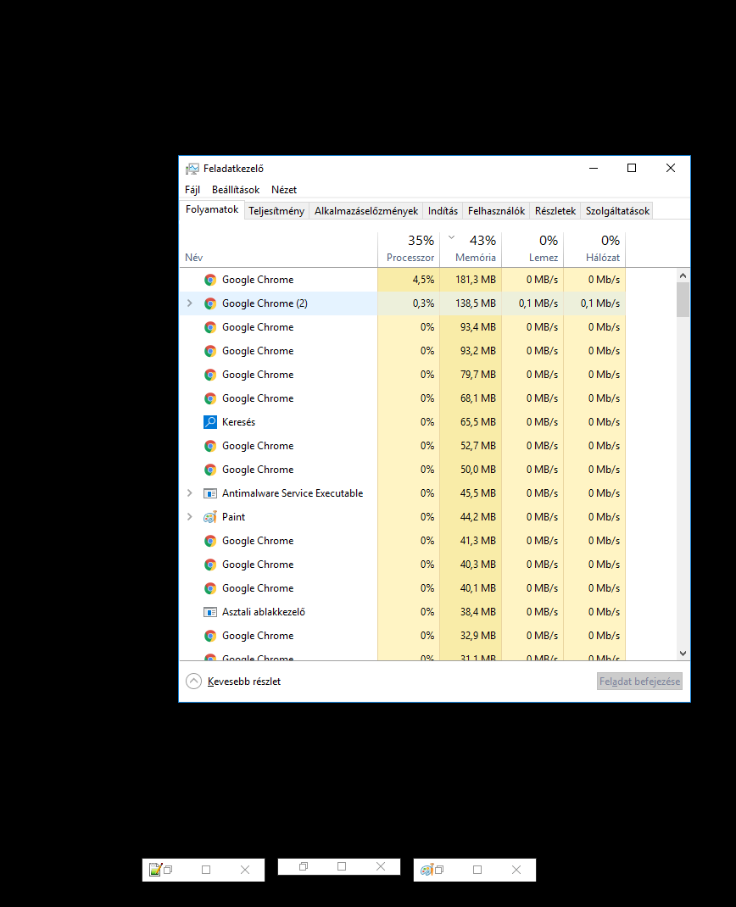
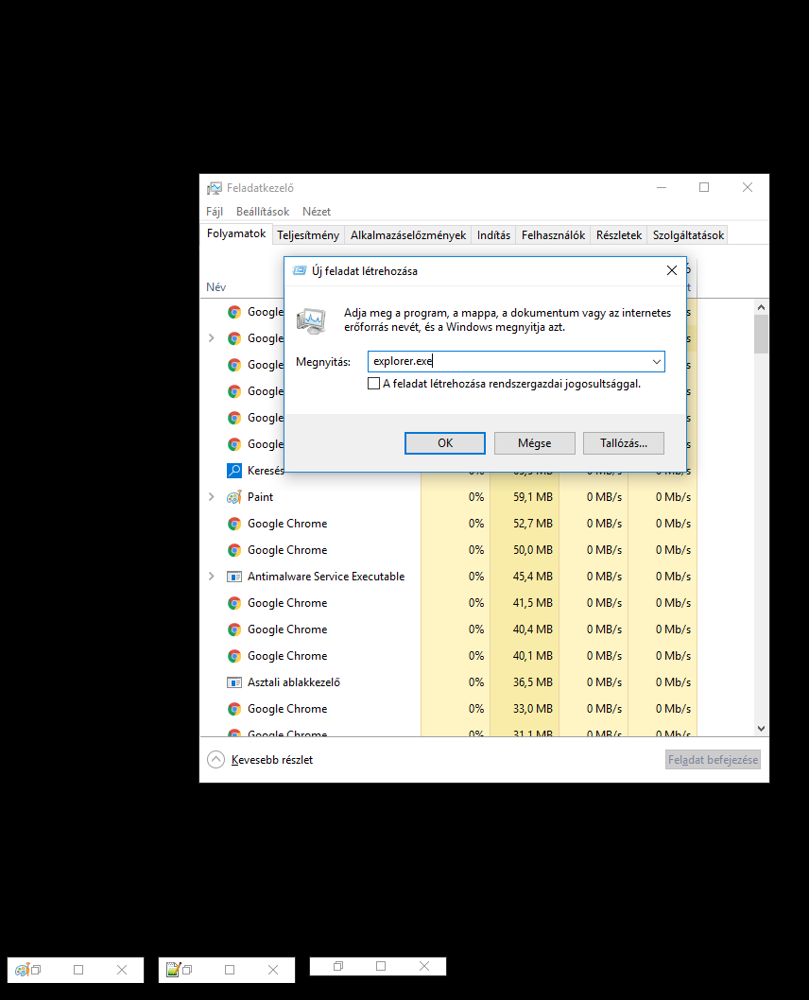
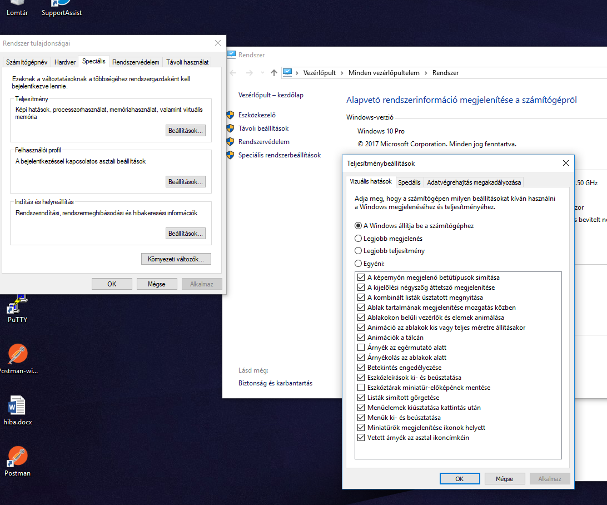

# Windows-Maintenance
Some solution / trick to improve computer's performance

# Built in tools
## Disc Cleanup
This application help to erase temporary data, log files, empty the Recycle Bin
  - check temporary files
  - empty Recycle Bin
  
  
## Defragment and Optimize Drives
This tool run automaticly in the background and has the biggest impact on HDD-s. When we delete a file, its actually not erased from the disc, just signed that part of the drive can be overwritten. After a while there will be holes in our data and become more complex to read to the computer and takes longer time.
Imagine a 3 people's ToDO list in one messy list like:

| Owner | ID | Description | 
|:---------|----|-----:|
|Peter|1|Take a nap|
|Stewee|1|Kill Lois|
||||
|Stewee|3|Make Brian upset|
|Peter|2|Drink a beer|
|Stewee|2|Take over the world|

If I want to get Peter's ToDos I have to jump 3 lines to get the 2nd one. The defragger will straighten up.

| Owner | ID | Description | 
|:---------|----|-----:|
|Peter|1|Take a nap|
|Peter|2|Drink a beer|
|Stewee|1|Kill Lois|
|Stewee|2|Take over the world|
|Stewee|3|Make Brian upset|

# 3rd party Software
## CCleaner
The CCleaner has a free trial version that affor a more specifit cleaning optian than the built in Disc Cleanup. With CCleaner we can erase application cache too.
https://www.piriform.com/ccleaner/download

## Malwerbytes
The Malwarebytes is a complett protection software, with the trial version we can detect and remove unwanted applications.
https://www.malwarebytes.com/premium/

# Tricks
## Check startup programs
In the task manager there is an option to list startup applications and let us to disable them if they are unnecessary.

## Explorer.exe
This is a heavy process  responsible to show system tray and ikons on desctop. We can kill this process trought task manager and restart it if neccessary.
  - kill
  Open task manager select `windows explorer`, and kill it with `end task`
  
  - restart
  Open task manager, select `files/new task` and type in "explorer.exe". After the OK button the tray and desktop ikon will appear again.
  
  
## Degrade Visual Effects
One of the most resource-consuming this graphical appearance. If you don't want go kill `explorer.exe` you can decrease it's severity.
 - Right click on `my computer` -> properties -> Advances system settings -> performance/settings
 - Uncheck as many checkbox as you can bear :)
 
 
# Hardware
## Keep clean your computer
The cooling systems are using fans to lead the heat away. The dust subside on them over time and reduce effectiveness. Clean them with compressed air or vacuum cleaner(1-2 times a year).
If you are brave enought you can disassembly your computer after varranty time. On youtube theare many videos how to do that, look for notebook type + "disassembly". like "dell inspiron 5567 disassembly"

## Solid State Drive
Every system is as fast as the slowest part. 

Processor > memory > hard drive > optical drive

The HDD-s has an attribute named `RPM`. There is a mechanical rotatin inside and it takes a lot of time.
  - 5000 Round Per Minute
  - 7200 Round Per Minute
  - 10000 Round Per Minute
  
The faster HDD needs more power and their lifetime shorter than a slower one. The SSD-s use flash memory, there is no any mechanical operation and your computer become extremly fast.
